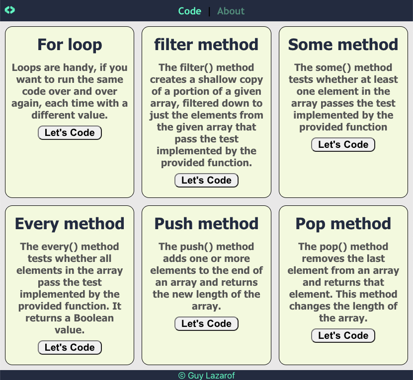
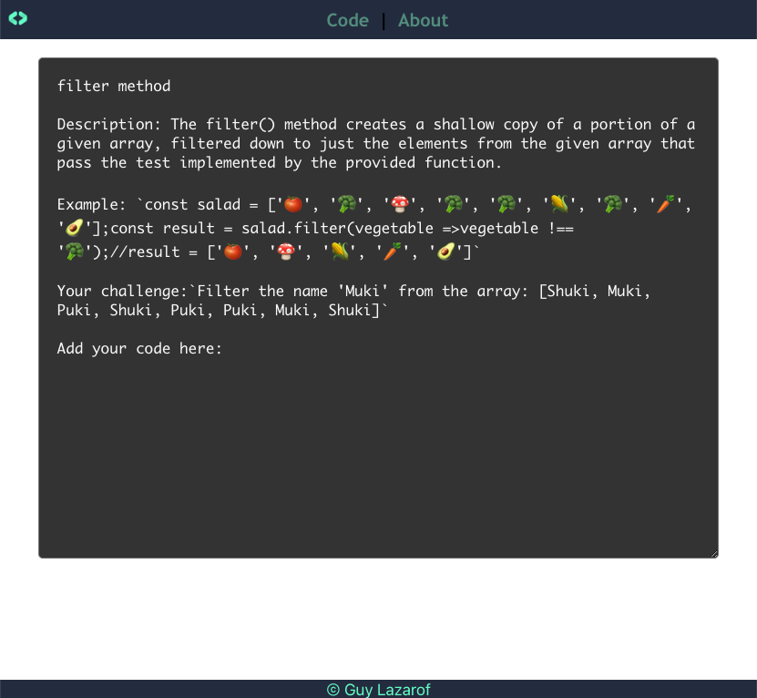
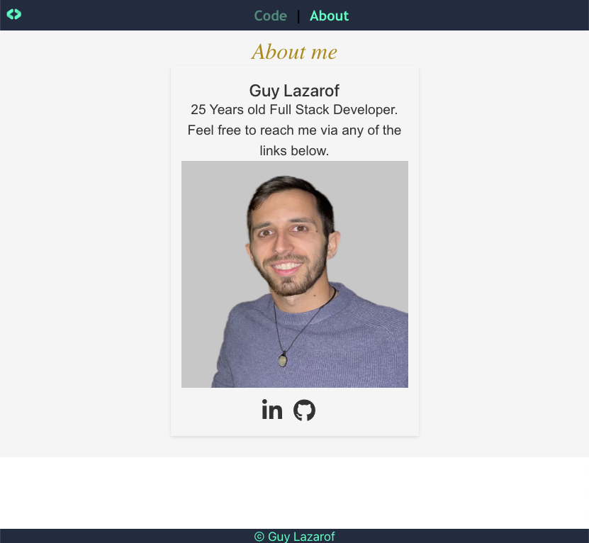

## About
### [➡️ Open the app ⬅️](https://mentor-student-websocket.onrender.com)
Wellcome, this is my Mentor-code-websocket!

It's an app to learn JS!
the mentor and the student can get into any question.
The student can learn and try while the mentor watch him writting the code (by Websocket).

if you start the code locally the orders are:
## 1) cd mentor-code-backend => npm start
## 2) cd mentor-code-frontend => npm start

Here some app views photos :)

The lobby view- choose subject to learn today!

Code-block learning environment!

About me!

